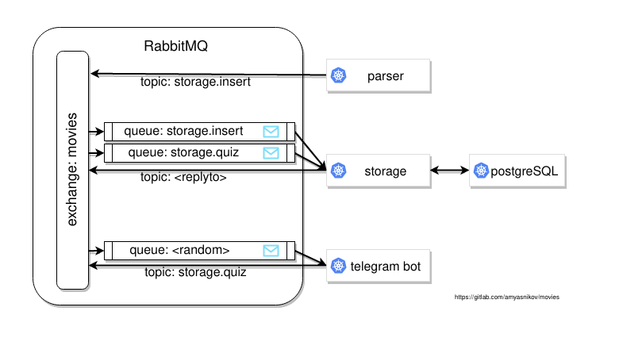
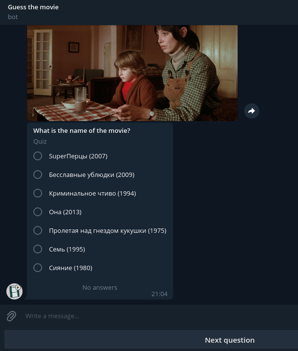
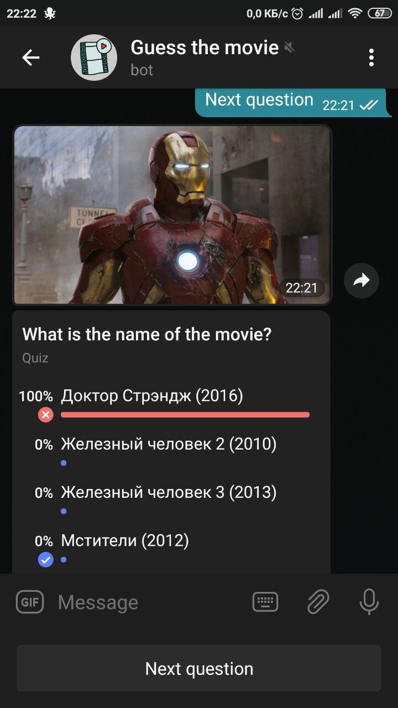

# MOVIES MICROSERVICES

* Author: Alexander Myasnikov
* mailto: myasnikov.alexander.s@gmail.com
* git: https://gitlab.com/amyasnikov/movies


## Description

* telegram bot @amyasnikov_movies_bot
* Guess the movie from the photo


## Architecture (simplified)




## Environment (if necessary)

```
make dev_messages   # start rabbitmq   service
make dev_storage    # start postgresql service
```


## Build

```
make depends
make storage
make parser
make bot
```


## Run

```
./build/storage
./build/parser
MOVIES_BOT_TOKEN= ./build/bot
```


## Build (Docker)

```
make storage_docker
make parser_docker
make bot_docker
```


## Run (Docker)

[docker-compose.yml](./docker-compose.yml)

```
docker-compose up
```


## Screenshots






